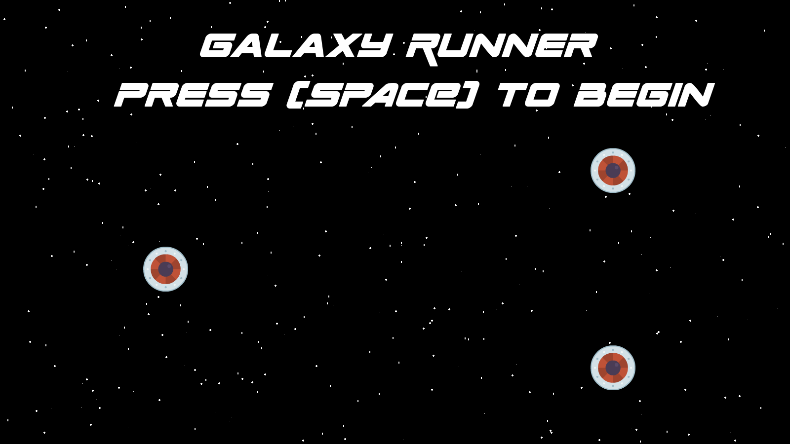

# Galaxy Runner

## Description:
  Spacewar is a single player space shooter. Fly throughout the universe dodging space rocks and fighting Enemy Space Ships! The ZIP file to download the game can be found here, [ZIP](https://github.com/bengarosi/galaxy-runner/archive/master.zip).

## Instructions:
  _To win the game, eliminate all enemy Space Ships._

  _If an enemy ship or space rock collides with the ship you are controlling, you will lose one shield, if you have no shield remaining, the game will end._

  _To begin the game, press the 'Space' key._

## Controls:
  _Move Left: A_

  _Move Right: D_

  _Move Up: W_

  _Move Up: S_

  _Shoot: Left Click_

  _Close Game: Escape_

## Credits:
  _Sounds:_

  All music and sound effects can be found and are free to download at https://freesound.org/ 
  
  _Images:_

  All images used in this game can be found on https://opengameart.org/

## Images:
  _Start Screen:_
  
  

  _In-Game:_
  
  
